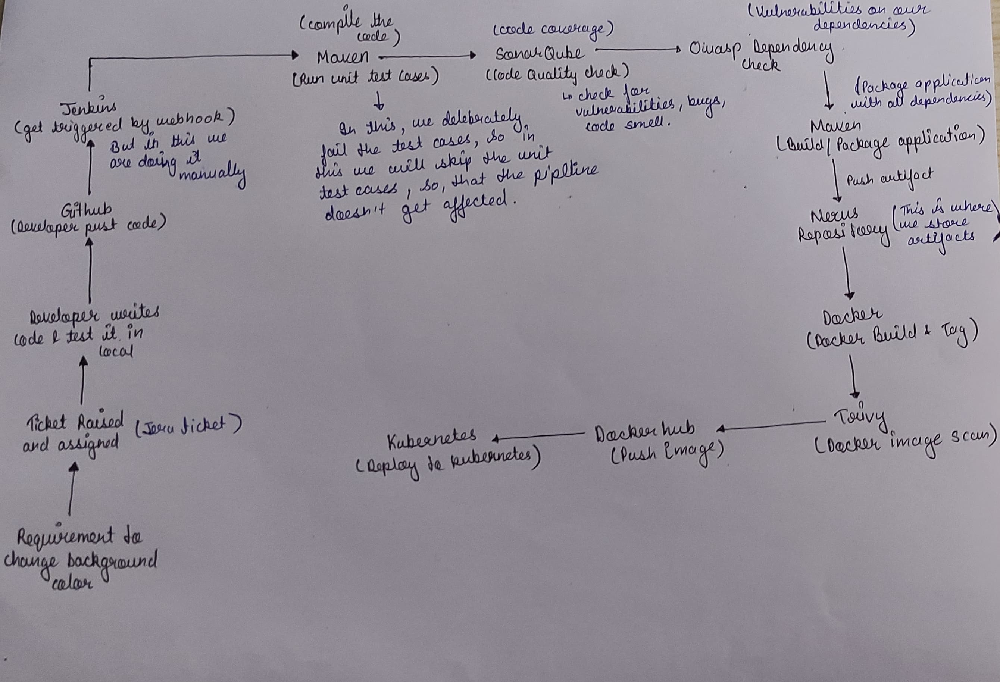

## Install Plugins in Jenkins

1. **Eclipse Temurin Installer**:
   - This plugin enables Jenkins to automatically install and configure the Eclipse Temurin JDK (formerly known as AdoptOpenJDK).
   - To install, go to Jenkins dashboard -> Manage Jenkins -> Manage Plugins -> Available tab.
   - Search for "Eclipse Temurin Installer" and select it.
   - Click on the "Install without restart" button.

2. **Pipeline Maven Integration**:
   - This plugin provides Maven support for Jenkins Pipeline.
   - It allows you to use Maven commands directly within your Jenkins Pipeline scripts.
   - To install, follow the same steps as above, but search for "Pipeline Maven Integration" instead.

3. **Config File Provider**:
   - This plugin allows you to define configuration files (e.g., properties, XML, JSON) centrally in Jenkins.
   - These configurations can then be referenced and used by your Jenkins jobs.
   - Install it using the same procedure as mentioned earlier.

4. **SonarQube Scanner**:
   - SonarQube is a code quality and security analysis tool.
   - This plugin integrates Jenkins with SonarQube by providing a scanner that analyzes code during builds.
   - You can install it from the Jenkins plugin manager as described above.

5. **Kubernetes CLI**:
   - This plugin allows Jenkins to interact with Kubernetes clusters using the Kubernetes command-line tool (`kubectl`).
   - It's useful for tasks like deploying applications to Kubernetes from Jenkins jobs.
   - Install it through the plugin manager.

6. **Kubernetes**:
   - This plugin integrates Jenkins with Kubernetes by allowing Jenkins agents to run as pods within a Kubernetes cluster.
   - It provides dynamic scaling and resource optimization capabilities for Jenkins builds.
   - Install it from the Jenkins plugin manager.

7. **Docker**:
   - This plugin allows Jenkins to interact with Docker, enabling Docker builds and integration with Docker registries.
   - You can use it to build Docker images, run Docker containers, and push/pull images from Docker registries.
   - Install it from the plugin manager.

8. **Docker Pipeline Step**:
   - This plugin extends Jenkins Pipeline with steps to build, publish, and run Docker containers as part of your Pipeline scripts.
   - It provides a convenient way to manage Docker containers directly from Jenkins Pipelines.
   - Install it through the plugin manager like the others.

After installing these plugins, you may need to configure them according to your specific environment and requirements. This typically involves setting up credentials, configuring paths, and specifying options in Jenkins global configuration or individual job configurations. Each plugin usually comes with its own set of documentation to guide you through the configuration process.

### This is the Rough Pipeline



## Pipeline 

```groovy
pipeline {
    agent any
    
    tools {
        maven 'maven3'
        jdk 'jdk17'
    }
    
    environment {
        SCANNER_HOME = tool 'sonar-scanner'
    }

    stages {
        stage('Git Checkout') {
            steps {
                git branch: 'main', url: 'https://github.com/aankusshh/Ekart.git'
            }
        }
        
        stage('Compile Source Code') {
            steps {
                sh "mvn compile"
            }
        }
        
        stage('Unit Testing') {
            steps {
                sh "mvn test -DskipTests=true"
            }
        }
        
        stage('SonarQube Analysis') {
            steps {
                withSonarQubeEnv('sonar') {
                    sh ''' $SCANNER_HOME/bin/sonar-scanner -Dsonar.projectKey=EKART -Dsonar.projectName=EKART \
                    -Dsonar.java.binaries=. ''' 
                }
            }
        }
        
        stage('Owasp Dependency Check') {
            steps {
                dependencyCheck additionalArguments: ' --scan ./', odcInstallation: 'DC'
                dependencyCheckPublisher pattern: '**/dependency-check-report.xml'
            }
        }
        
        stage('Build') {
            steps {
                sh "mvn package -DskipTests=true"
            }
        }
        
        stage('Deploy to Nexus') {
            steps {
                withMaven(globalMavenSettingsConfig: 'global-maven', jdk: 'jdk17', maven: 'maven3', mavenSettingsConfig: '', traceability: true) {
                    sh "mvn deploy -DskipTests=true"
                }
            }
        }
        
        stage('Build and Tag Docker Image') {
            steps {
                script {
                    withDockerRegistry(credentialsId: 'docker-cred', toolName: 'docker') {
                    sh "docker build -t aankusshhh/ekart:latest -f docker/Dockerfile ."
                    }
                }
            }
        }
        
        stage('Trivy Scan') {
            steps {
                sh "trivy image aankusshhh/ekart:latest > trivy-report.txt"
            }
        }
        
        stage('Docker push Image') {
            steps {
                script {
                    withDockerRegistry(credentialsId: 'docker-cred', toolName: 'docker') {
                    sh "docker push aankusshhh/ekart:latest"
                    }
                }
            }
        }
        
        stage('Kubernetes Deploy') {
            steps {
                withKubeConfig(caCertificate: '', clusterName: '', contextName: '', credentialsId: 'k8-token', namespace: 'webapps', restrictKubeConfigAccess: false, serverUrl: 'https://172.31.45.235:6443') {
                    sh "kubectl apply -f deploymentservice.yml -n webapps"
                    sh "kubectl get svc -n webapps"
                }
            }
        }
    }
 
        
    }
    post {
    always {
        script {
            def jobName = env.JOB_NAME
            def buildNumber = env.BUILD_NUMBER
            def pipelineStatus = currentBuild.result ?: 'UNKNOWN'
            def bannerColor = pipelineStatus.toUpperCase() == 'SUCCESS' ? 'green' : 'red'

            def body = """
                <html>
                <body>
                <div style="border: 4px solid ${bannerColor}; padding: 10px;">
                <h2>${jobName} - Build ${buildNumber}</h2>
                <div style="background-color: ${bannerColor}; padding: 10px;">
                <h3 style="color: white;">Pipeline Status: ${pipelineStatus.toUpperCase()}</h3>
                </div>
                <p>Check the <a href="${BUILD_URL}">console output</a>.</p>
                </div>
                </body>
                </html>
            """

            emailext (
                subject: "${jobName} - Build ${buildNumber} - ${pipelineStatus.toUpperCase()}",
                body: body,
                to: 'ankush56singh@gmail.com',
                from: 'jenkins@example.com',
                replyTo: 'jenkins@example.com',
                mimeType: 'text/html',
                attachmentsPattern: 'trivy-image-report.html'
            )
        }
    }
}

}
```
