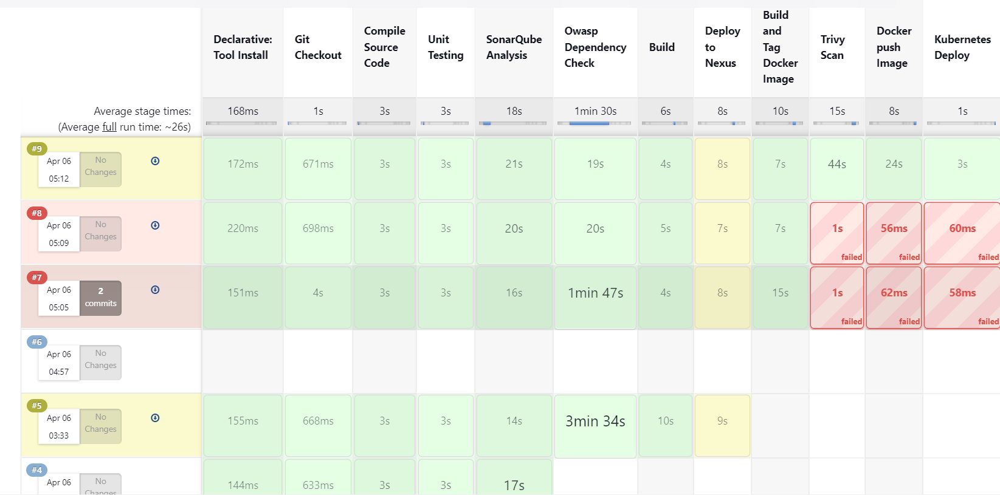

# Phase 1
Create EC2 instances for the following
- JENKINS (INstall docker , java, jenkins) -> run on port 8080 by default [Click Here](https://github.com/aankusshh/Pipeline-Ekart/blob/main/Set%20up%20Jenkins%20Server.md)
- SonarQube (install Docker, install sonarQube) -> sudo docker run -d -p 9000:9000 sonarqube:lts-community [Click Here](https://github.com/aankusshh/Pipeline-Ekart/blob/main/Set-up%20SonarQube.md)
- Nexus (install docker, nexus) -> sudo docker -d -p 8081:8081 sonatype/nexus3 [Click Here](https://github.com/aankusshh/Pipeline-Ekart/blob/main/Setup%20Nexus.md)
- Kubernetes (1 master, 2 slave servers )(docker, kubernetes) [Click Here](https://github.com/aankusshh/Pipeline-Ekart/blob/main/Setup%20Kubernetes.md)
All installation command with guidelines are provided in the same repo please read it carefully.

# Phase 2
- Install plugins
- Configure Tools
- Connet Tools
- Create pipeline
All these stpes are explained in 'CICD Plugins and Code.md' file [Click Here](https://github.com/aankusshh/Pipeline-Ekart/blob/main/CICD%20Plugins%20and%20Code.md), fololow the steps to create the pipeline.

# Phase 3
After the successfull creation of the pipeline, go to the console output in jenkins it will provide you the port number in which the application is running.
Copy the ip address of slave 1 and paste it like (eg. 1.1.1.1:31623)

# RESULT

For All the result images [Click here](https://github.com/aankusshh/Pipeline-Ekart/blob/main/Results.md)

