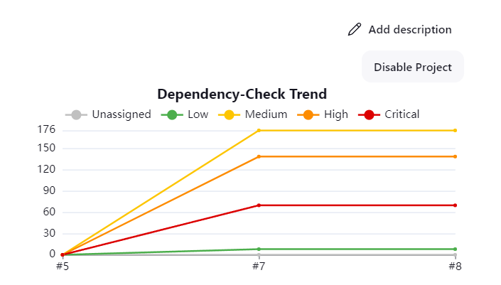
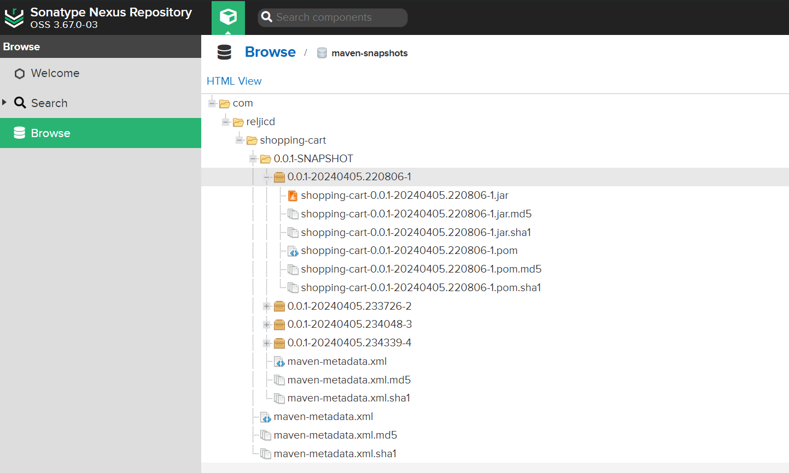
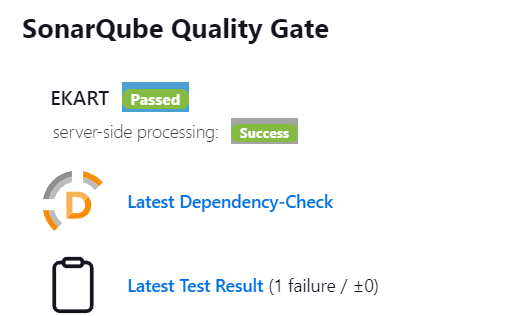
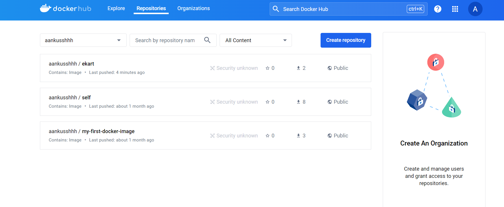
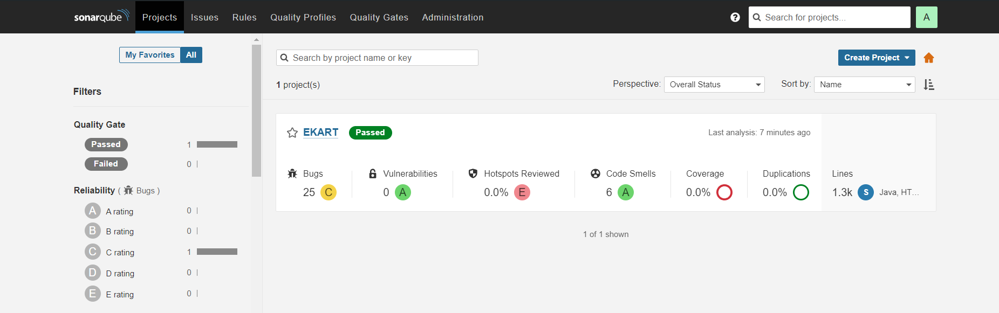
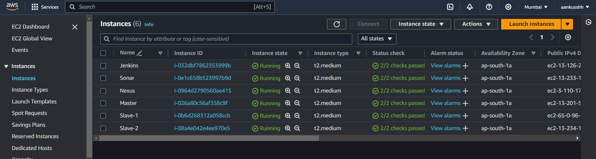
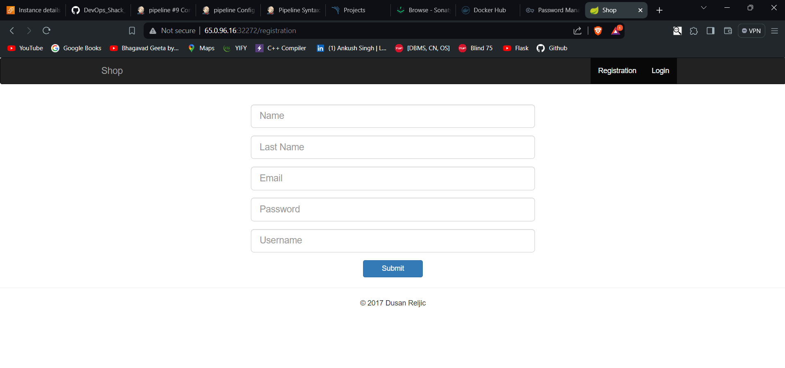
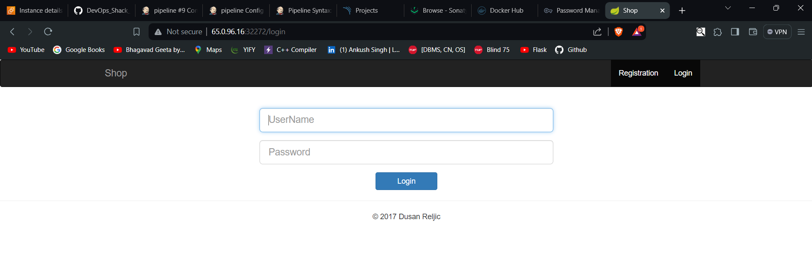
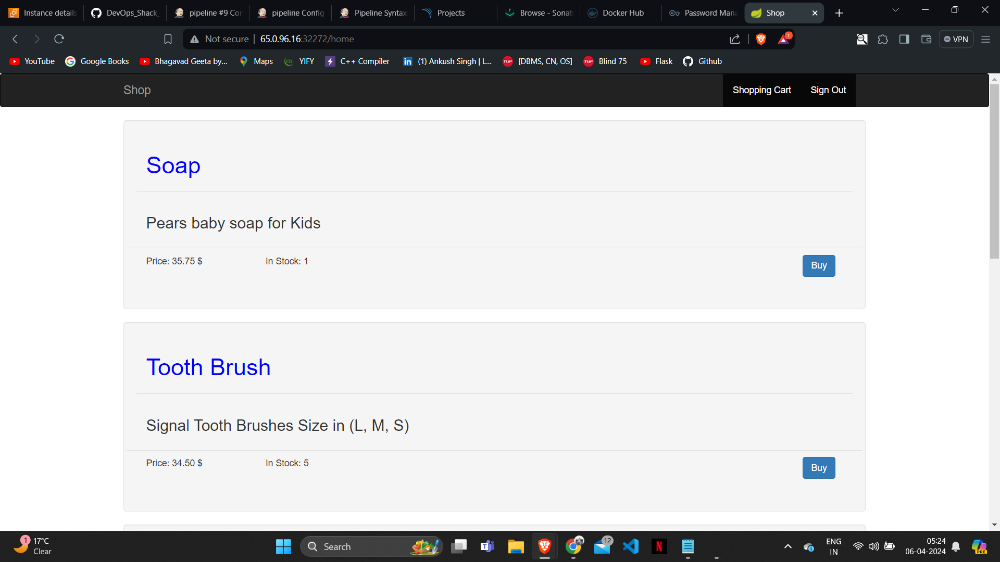

## CICD Pipeline Result

It Showcases that the Each step in the pipeline is running properly.

## Owasp Dependency Check

## Artifacts in Nexus Repository (In maven-snapshot)

## SonarQube Quality Check

## Image pushed to DockerHUb

## SonarQube Quality Check Result

## Types of VM we have created

## User interface of Deployed Ekart Website (Signup Page)

## User interface of Deployed Ekart Website (Login Page)

## User interface of Deployed Ekart Website (Main Page)

